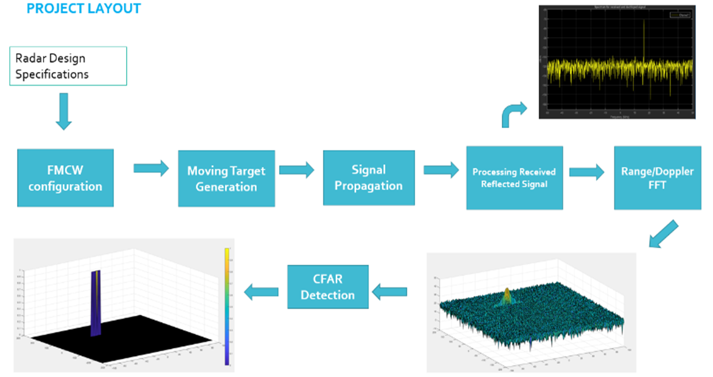

# Radar Target Generation & Detection

### Project Description

The objective of this project was to simulate a Frequency-Modulated Continuous-Wave (FMCW) radar detection of a moving target, and then to perform signal processing functions to estimate the range and doppler velocity of the simulated target

## Instructions for Running Locally
* Install MATLAB
  * Code was developed using R2020a and not tested for backward compatability with previous releases
  * main project code is contained within script radarTargetGenerationAndDetection.m
  * sensorFusionWithRadar.m requires the Automated Driving Toolbox
